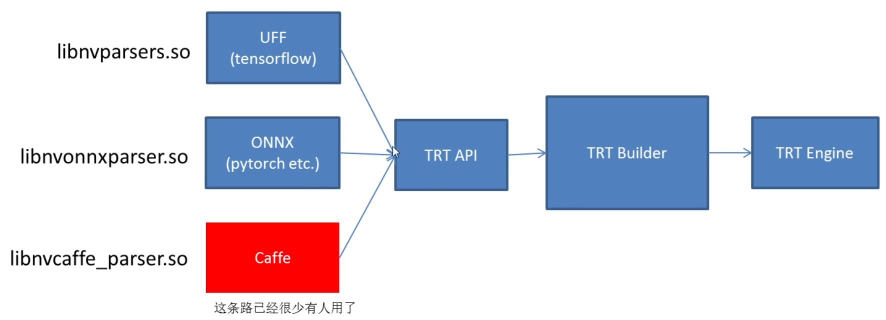
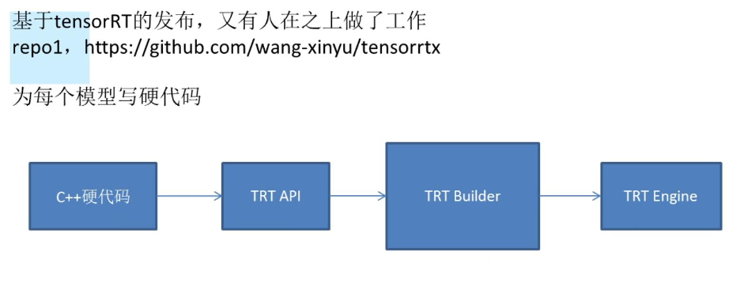
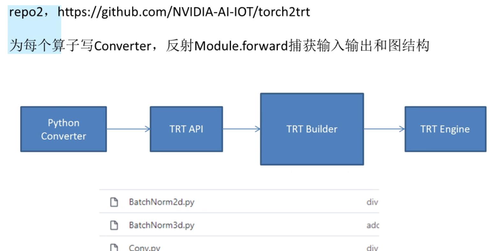
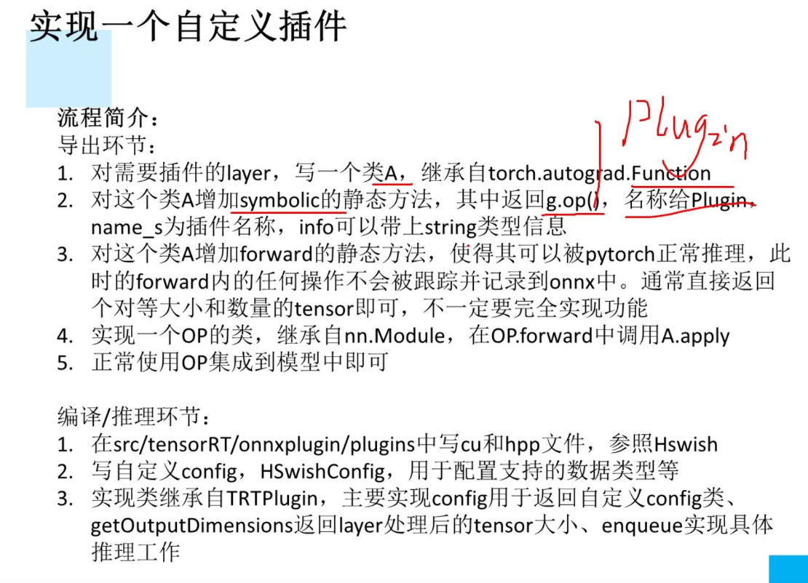
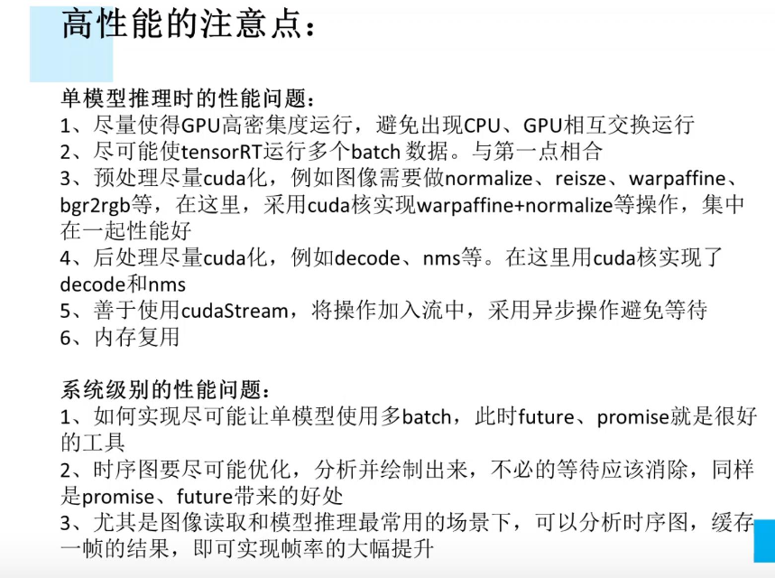

# TernsorRT的学习

## 一. ternsorRT的资料
  - https://github.com/pytorch/TensorRT
  - https://github.com/NVIDIA/TensorRT
  - https://github.com/onnx/onnx-tensorrt
  - pytorch2.0中的TorchDynamo模块:https://mp.weixin.qq.com/s/CEK6NcX9QB8mgqywApLQrQ

## 二. 课程
> 另外还有三门课程：官方的，贾老师的，此作者的
1. tensorrt：https://developer.nvidia.com/zh-cn/tensorrt
1. 课程地址：https://www.bilibili.com/video/BV1Xw411f7FW
1. 代码地址：https://github.com/shouxieai/tensorRT_cpp
1. P1 1、课程介绍 07:59
1. P2 2、驾驭TensorRT的方案介绍 22:37

1. P3 3、如何正确导出onnx并在c++中推理 08:53

1. P4 4、动态batch和动态宽高的实现 12:09

1. P5 5、写一个自定义插件 22:40

1. P6 6、关于封装 37:25
1. P7 7.1、YoloV5案例第一部分，导出ONNX 23:03
1. P8 7.2、YoloV5案例第二部分，细节 38:03
1. P9 8、Retinaface案例和动态宽高 40:19
1. P10 9、高性能低耦合 26:34

1. P11 10、YOLOX集成

## 三. 嵌入式jetson上允许tensorRT
- https://github.com/dusty-nv/jetson-inference
- https://elinux.org/Jetson_Zoo
- 姿态估计: https://github.com/NVIDIA-AI-IOT/trt_pose