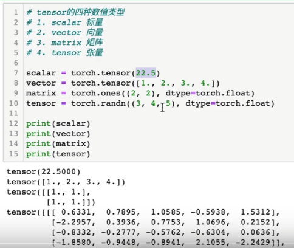
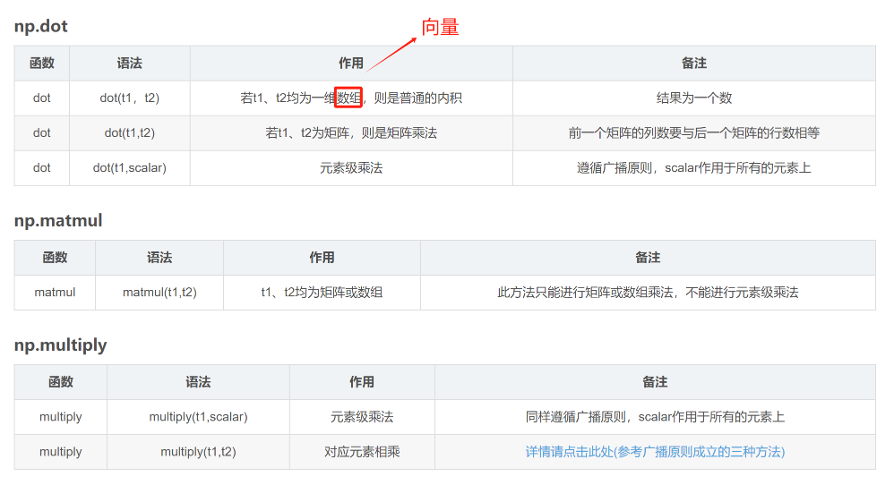
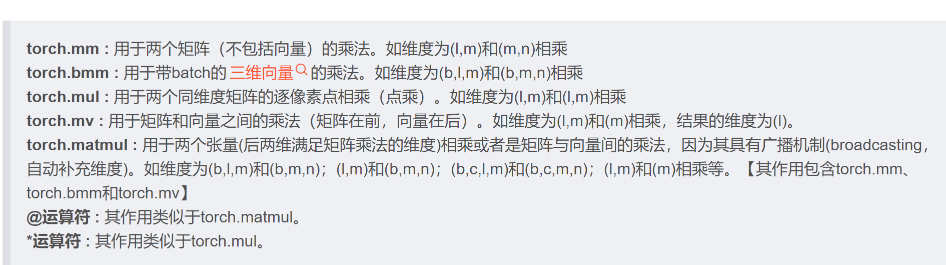

# numpy-pyortch-数据类型比较

## 一. 数据类型与运算

1. 标量（0维）：数乘
   - 前者的shape是(), 后者是[]
2. 向量（1维）：点乘，对应元素乘法
   - numpy和pytorch都不区分行向量和列向量，前者的shape是(n,), 后者是[n]
   - numpy会自动判断此时的一维数组应该取行向量还是列向量
   - numpy和pytorch都可以用二维向量来表示行向量或者列向量，点乘就是矩阵乘法。
3. 矩阵（2维）：矩阵乘，求逆等
4. 张量（2+维）：矩阵数组，最后两维满足矩阵

## 二. 运算
1. 数乘：
2. 点乘：dot，
3. 矩阵乘：matmul，@
4. 对应元素乘法：mutiply，*
5. 矩阵的其他运算：求逆等
5. 张量的运算：是把前面n-2维看做batch计算的，后面两维相乘，这样可以转换为二维矩阵运算
5. numpy与pytorch
   - 
   - 

## 三. 参考
1. https://blog.csdn.net/qq_43212169/article/details/101754628
2. https://www.cnblogs.com/seekingmzr/articles/16206733.html
3. https://blog.csdn.net/astupidspiderman/article/details/130278799
