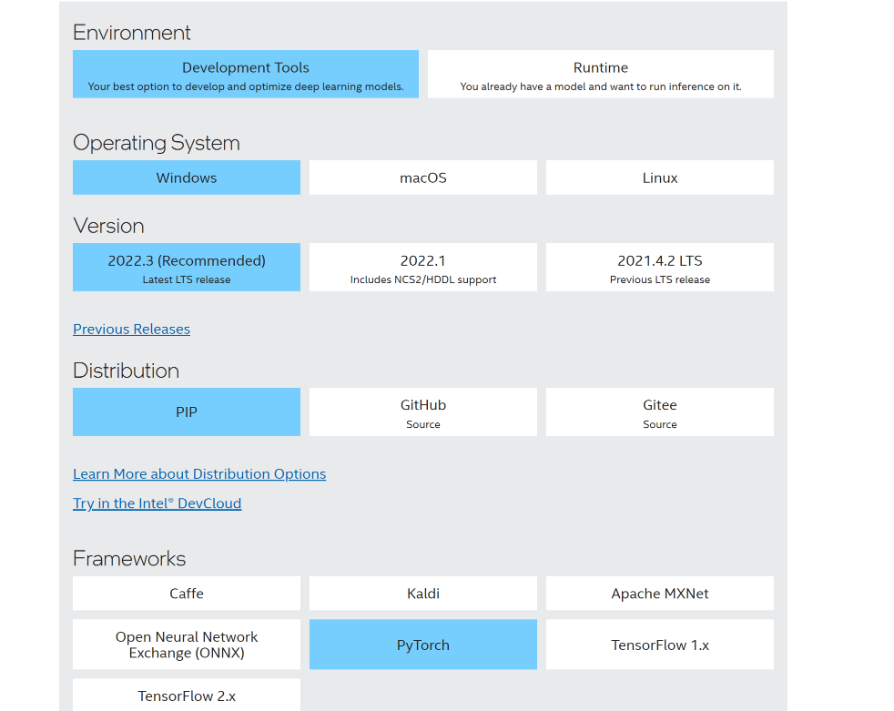
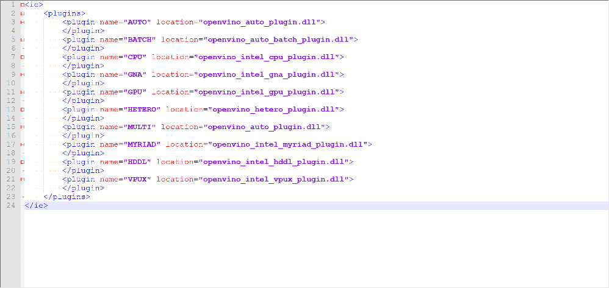

# openvino的使用
> openvino现在把模型转换工具、模型推理库分开

## 一. 组件下载


## 二. 开发工具：下载转换模型

```
pip install openvino-dev[ONNX,pytorch]==2022.3.0
```

```
set PATH=%PATH%;C:\Users\MoMing\.conda\envs\openvino
call "C:\Users\MoMing\Desktop\dsj\ad-det\w_openvino_toolkit_windows_2022.3.0.9052.9752fafe8eb_x86_64\setupvars.bat"
C:\Users\MoMing\.conda\envs\openvino\Scripts\mo.exe --input_model ad-det-sim.onnx --output /Sigmoid_1_output_0,/Sigmoid_3_output_0 --output_dir sample\openvino
```

## 三. 运行时库：部署推理工具，支持c++和python。
直接下载，如：w_openvino_toolkit_windows_2022.3.0.9052.9752fafe8eb_x86_64.zip

openvino有很多插件，支持intel的各种设备


