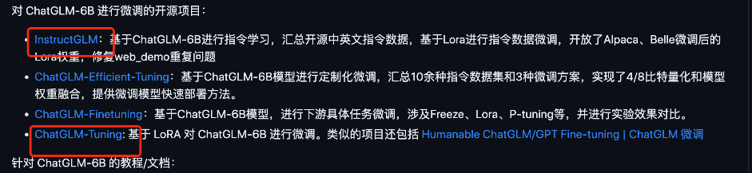

# 微调训练
1. p-tuning
2. lora-tuning
3. fine-tuning
4. prompt-tuning

大模型参数高效微调技术原理综述（一）-背景、参数高效微调简介
大模型参数高效微调技术原理综述（二）-BitFit、Prefix Tuning、Prompt Tuning
大模型参数高效微调技术原理综述（三）-P-Tuning、P-Tuning v2
大模型参数高效微调技术原理综述（四）-Adapter Tuning及其变体
大模型参数高效微调技术原理综述（五）-LoRA、AdaLoRA、QLoRA
大模型参数高效微调技术原理综述（六）-MAM Adapter、UniPELT
大模型参数高效微调技术原理综述（七）-最佳实践、总结