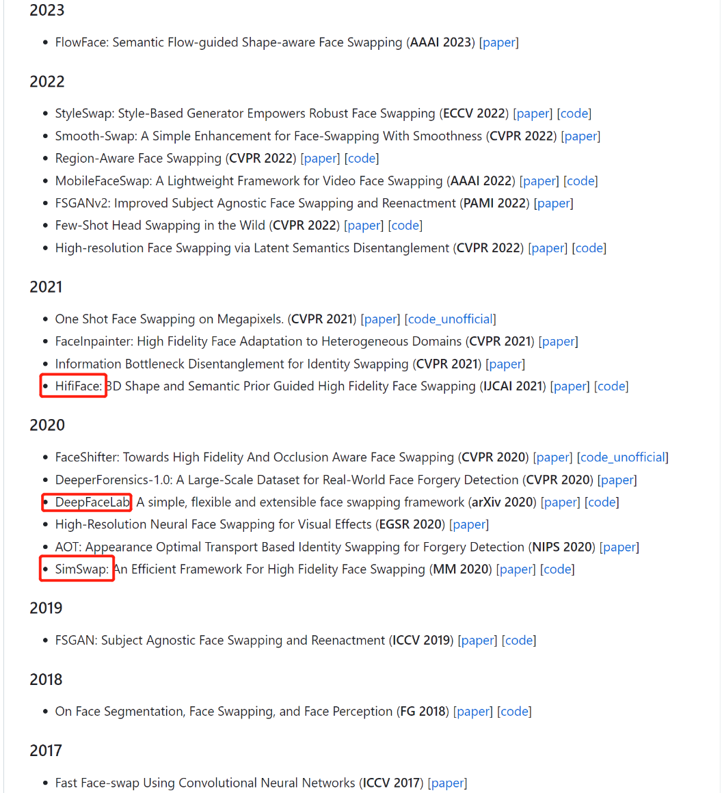
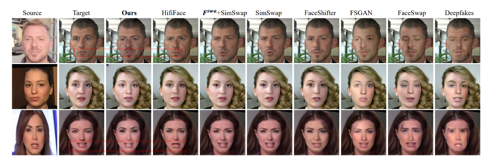
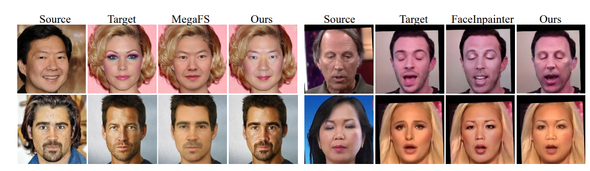
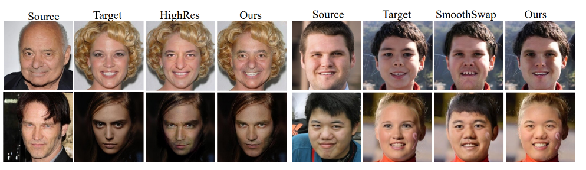

# 换脸-01-概述
> 目标：单图、低成本换脸

## 一. 结论
1. 之前研究过的方案，都不太可行
    - stableDiffusion：目标脸用提示词确定，相当关开盲盒
    - stableDiffusion + lora：需要对每个人训练
    - DeepFaceLab：需要对每个人训练，又慢有麻烦
2. 准备去探索几个换脸方案
    - insightface 
    - MobileFaceSwap 
    - SimSwap + SimSwapPlus 
    - HifiFace

## 二. 开源方案汇总
- [insightface](https://github.com/deepinsight/insightface/blob/master/examples/in_swapper/README.md)
- https://github.com/DaddyJin/awesome-faceSwap

## 三. 市场概述
> 来自FlowFace的论文

