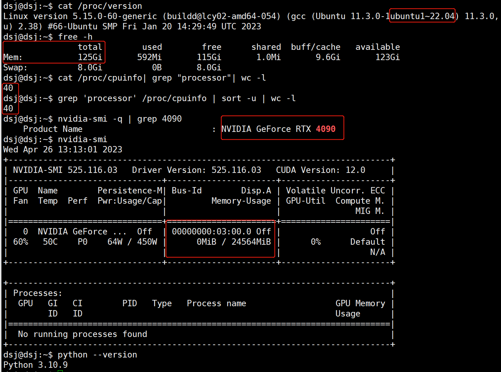

# Linux(ubuntu22.04)+4090显卡搭建AI工作站
> 显卡驱动：最新版，其实也可以从cuda一起安装
> 
> pytorch：1.13.1， 2.0太新暂时不用
>
> cuda：最低11.7或者最高11.8，至少11.7才支持4090，pytroch最高支持11.8
> 
> cuDNN: v8.9.0 (April 11th, 2023), for CUDA 11.x
> 
> TensorRT: 8.6 EA

### 一. 安装驱动
>直接安装驱动，会提示你安装gcc，libc，进而需要配置ubuntu的软件源。
1. 官网下载驱动直接安装：
   - https://blog.csdn.net/weixin_45901519/article/details/108252106
2. 依赖工具安装
   - sudo apt-get install libc6-dev build-essential
3. 清华ubuntu的软件源(版本要选对)配置
   - https://mirrors.tuna.tsinghua.edu.cn/help/ubuntu/
4. 查看显卡信息
   - https://blog.csdn.net/weixin_42337304/article/details/121681264

### 二. 安装python
- 下载anconda：https://www.anaconda.com/download#downloads
- 配置anconda: https://blog.csdn.net/qq_44173974/article/details/125336916
- 配置conda和pip源配置
   ```
   conda init bash
   source activate
   conda deactivate
   ```
### 三. 安装cuda，cudnn，tensorrt，pytorch,nvenc
1. 3090至少要装cuda11.6，4090必须要装cuda11.7
   - 因为pytorch会根据设备架构动态的编译，nvrtc。
   - cuda11.6只支持到3090，arch=8.6
   - cuda11.7只支持到4090，arch=8.9
   - 这里不建议装cuda 12，因为pytorch还没有升级到
   - 用pytorch查看arch信息
   ```      
   python -c "import torch;print(torch.cuda.get_device_capability(0))"
   python -c "import torch;print(torch.cuda.get_gencode_flags())"
   python -c "import torch;print(torch.cuda.get_arch_list())"
   ```
2. 如果要装cuda c++sdk到PATH环境，那么和cuda python版本必须匹配，不然会冲突。
   - 版本不匹配nvrtc报错
   ```
   RuntimeError: The following operation failed in the TorchScript interpreter.
   Traceback of TorchScript (most recent call last):
   RuntimeError: nvrtc: error: invalid value for --gpu-architecture (-arch)
   ```
3. cuda c++ SDK
   - wget https://developer.download.nvidia.com/compute/cuda/11.7.0/local_installers/cuda_11.7.0_515.43.04_linux.run
   - sudo sh cuda_11.7.0_515.43.04_linux.run
   - 安装完后的提示信息
   ```
   Driver:   Not Selected
   Toolkit:  Installed in /usr/local/cuda-11.6/
   
   Please make sure that
    -   PATH includes /usr/local/cuda-11.6/bin
    -   LD_LIBRARY_PATH includes /usr/local/cuda-11.6/lib64, or, add /usr/local/cuda-11.6/lib64 to /etc/ld.so.conf and run ldconfig as root
   
   To uninstall the CUDA Toolkit, run cuda-uninstaller in /usr/local/cuda-11.6/bin
   ***WARNING: Incomplete installation! This installation did not install the CUDA Driver. A driver of version at least 510.00 is required for CUDA 11.6 functionality to work.
   To install the driver using this installer, run the following command, replacing <CudaInstaller> with the name of this run file:
       sudo <CudaInstaller>.run --silent --driver
   
   ```
4. CUDA python + pytorch
   - pip install torch==1.13.1+cu117 torchvision==0.14.1+cu117 torchaudio==0.13.1 --extra-index-url https://download.pytorch.org/whl/cu117
### 四. 结果


