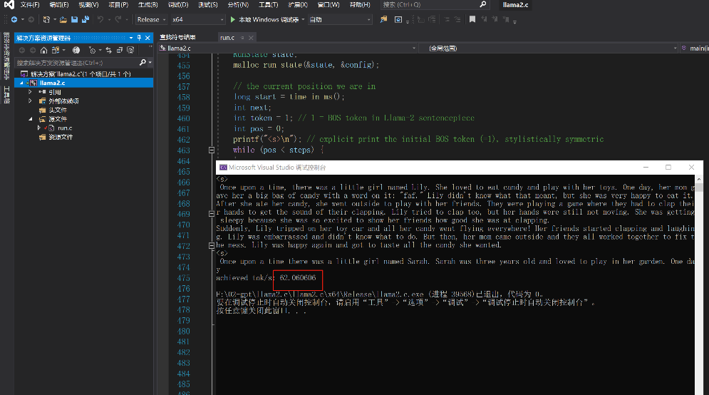

# llama2

## llama2.c
应该是作者简化了模型层数，但整体结构是类似的
作者在58MB的TinyStories训练3个级别的模型，可以做到~110 tokens/s
而直接推流llama2_7b，只能4 tokens/s

作者提供了 训练方法，可以借机学习llama2的结构和训练自己的数据集

## 工具
https://github.com/Alpha-VLLM/LLaMA2-Accessory