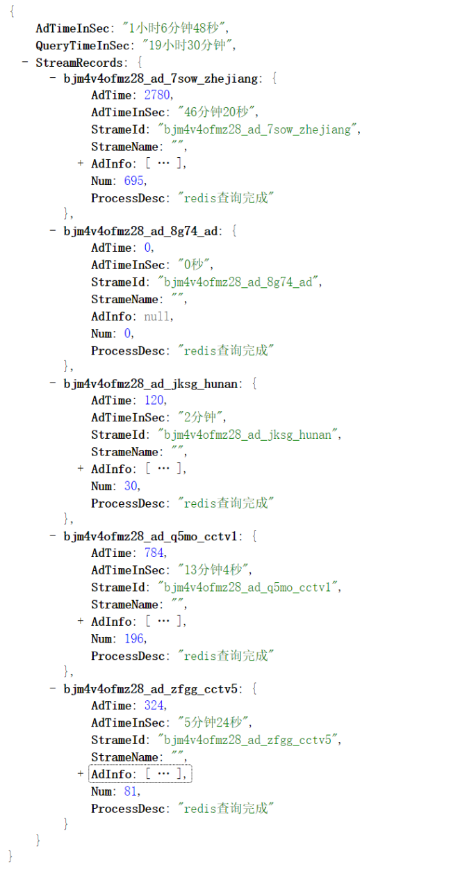
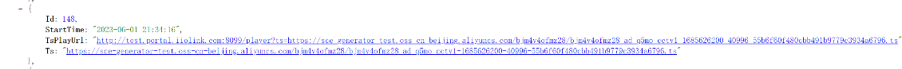
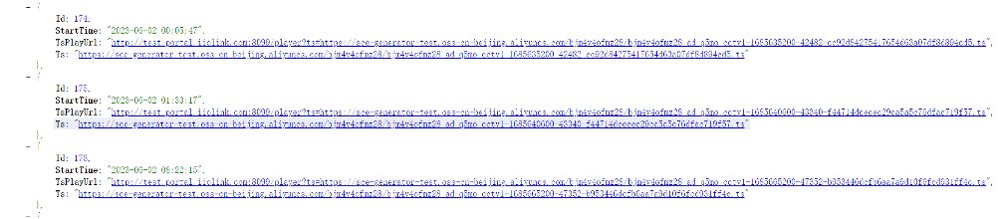

# 广告检测统计报告（2023-06-02）
>四个频道(cctv10,cctv5,湖南卫视，四川卫视）最近20小时的广告统计报告 

## 一. 总结报告
|         | 四川卫视 | 湖南卫视 | cctv10  | cctv5  | 汇总        |
|---------|------|------|---------|--------|-----------|
| 检测到广告时长 | 46分钟 | 2分钟  | 12分钟28秒 | 5分钟24秒 | 1小时5分钟52秒 |
| 检测到广告片段数   | 690  | 30   | 187     | 81     | 988       |
| 误检片段数   | 0    | 0    | 4       | 0      | 4         |
| 误检率     | 0%   | 0% | 2.13%   | 0%     | 0.4%      |
> 1. 模型能力极大提升
> 2. 检测到卫视的广告明显多于央视，湖南卫视是例外。 估计地方台会更多广告。

## 二. 数据来源
1. 所有的统计量，视频文件都在这里：

2. 一共错了四段

## 三. 原因分析，解决办法
1. 还有极少数的文字干扰：继续扩展负样本空间

## 四. 下一步
1. 完善模型 + 10-20个频道测试。

