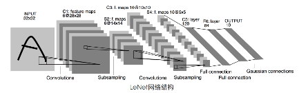

# AI模型

## 一. 基础模型
1. MLP
2. CNN
3. RNN/LSTM
4. GAN
5. GNN
6. ResNet
7. Self-Attention 
    - MLP,CNN,RNN的超集
8. Transform 
    - 处理序列问题
9. ViT
10. CLIP

## 二. CV模型
1. 图像分类
    - LeNet
      - CNN模型：
      - loss：MSE
2. 目标检测
3. 图像分割
4. 关键点检测
5. 目标跟踪
6. 视频理解

## 三. NLP模型
1. 文本分类
2. 分词标注
3. 机器翻译
4. 自动摘要
5. 聊天机器人

## 四. ASP模型
1. 音频分类
2. 音频检索
3. 语音识别
4. 语音合成
5. 声音克隆

## 五. AIGC模型
1. 文本生成
2. 图像生成
3. 视频生成
4. 声音生成
5. 音乐生成
6. 3D生成

## 六. 其他模型