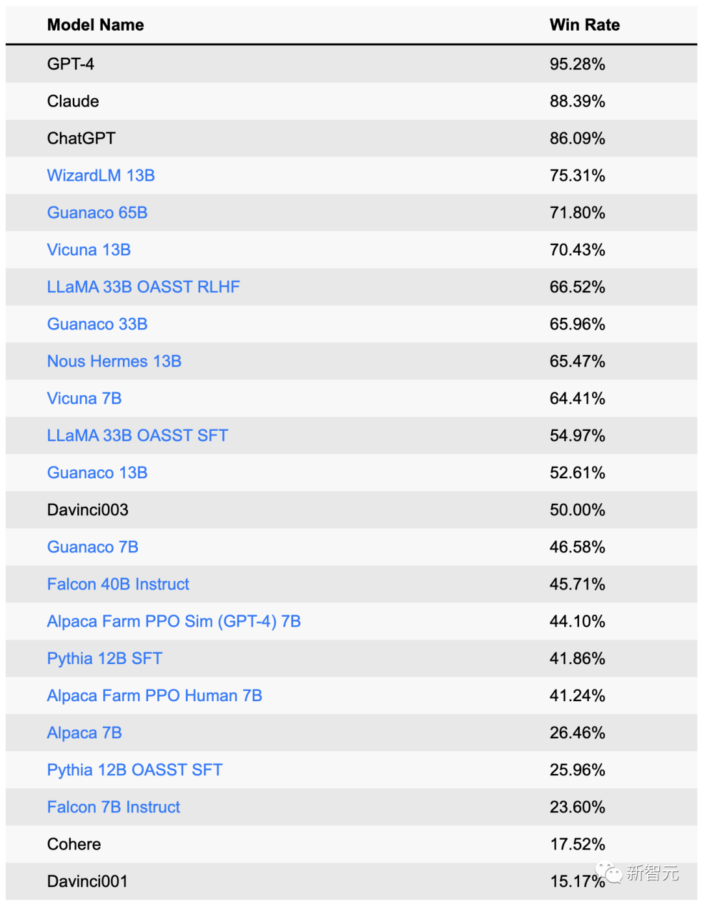

# AI项目发布记录

## 一. 主要项目
1. whisper：openapi发布语音识别
1. Segment Anything：4 月初，Meta 发布了史上首个图像分割基础模型--SAM（Segment Anything Model）
1. Inpaint Anything：基于 SAM，提出「修补一切」（Inpaint Anything，简称 IA）模型
1. dragGAN：AI图像拖动编辑, 有人实现并开源
1. Massively Multilingual Speech:Meta 的开源语音 AI 项目 MMS 可识别 4000 多种口头语言
1. Rask.AI：AI视频配音转译 付费
1. sadtalker：语音驱动图像的数字人 开源
1. 最强文本转语音工具：Bark https://github.com/suno-ai/bark
1. google发布styledrop：https://styledrop.github.io/
1. runway gen2 文字视频生成
1. Meta 开源了一个 AI 生成音乐工具 Audiocraft
   - 可以直接在线体验：https://huggingface.co/spaces/facebook/MusicGen
   - 可以离线部署，项目地址：https://github.com/facebookresearch/audiocraft
1. ControlNet
   - 1.1发布，支持tile
   - refrence only
   - inpaint
1. Rerender A Video：视频转绘，解决mj和sd逐帧处理视频带来的抖动
1. 一键换装，被谷歌给实现了！
   - https://tryondiffusion.github.io/
   - https://mp.weixin.qq.com/s/kKh5FsxxqYe9378GDw41kw
   - 没有demo，也没开源

## 二. LLM

## 三. 主要课程
1. 【生成式AI】李宏毅2023春季课程:https://speech.ee.ntu.edu.tw/~hylee/ml/2023-spring.php
2.  B站Stable Duffison使用教程
2. 【promot工程】吴恩达
2. 吴恩达的三门课，主题包括LangChain、扩散模型，以及用ChatGPT API搭建系统
3. 小工蚁创始人系列课程
4. GPT大模型微调方法系列