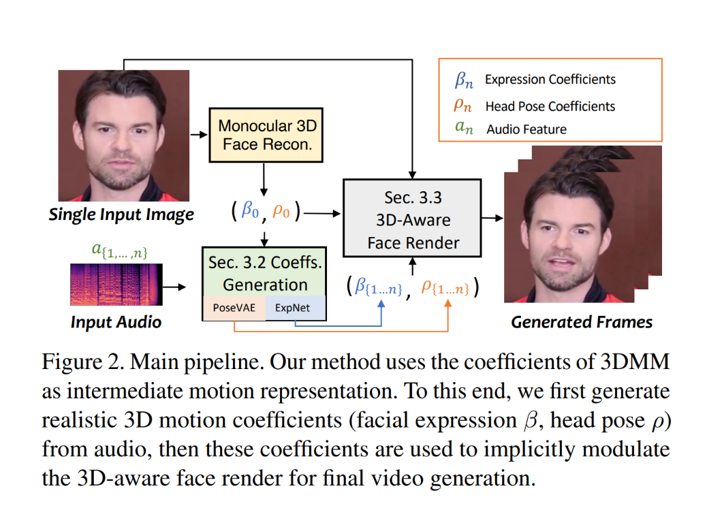

在千禧年的下半年, 3DMM(3D Morphable Model)横空出世(中文名: 3D 可变形模型/参数化模型), 奠定了 10 多年后 3D Avatar(数字人/虚拟人)落地开花的基础
https://zhuanlan.zhihu.com/p/634381271

两个网络+1个mapping：
1. face_3drecon
2. audio2pose
2. audio2exp 
3. facevid2vid
3. mapping

知识：
1. 人脸对齐1：https://zhuanlan.zhihu.com/p/405746101
2. 人脸对齐2：https://blog.csdn.net/qq_42722197/article/details/121668671
3. 

## 预处理
1. crop：
    - get_landmark
    - align_face
    - 

## 音频转3D系数

## 视频渲染

first_coeff_path, crop_pic_path, crop_info =  preprocess_model.generate

