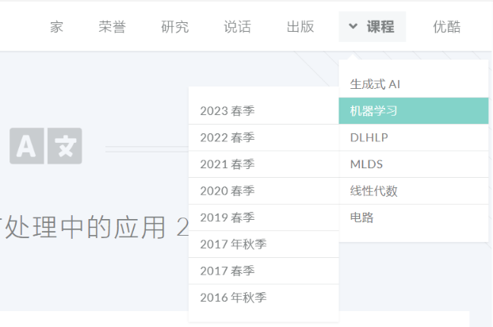

# 李宏毅课程
> 以《机器学习-2021》为基础开始展开。
> 配套书：https://github.com/datawhalechina/leedl-tutorial

## ML：机器学习 2016-2023(时间倒序看)
1. 2024-生成式AI 
    - chatgpt与视频生成
1. 2023-机器学习
    - chatgpt与Diffusion Model 
2. 2022-机器学习
3. 2021-机器学习
    - CNN & Self-Attention
    - Transformer
    - Generative Model
    - Self-Supervised Learning
    - RL强化学习
## DLHLP：Deep Learning for Human Language Processing 
## MLDS: 机器学习机器深度和结构

