# 深度学习概述
## 一. 深度学习的应用案例
### 1. 案例1：马斯克换脸钢铁侠
   马赛克演讲视频.mp4
   钢铁侠男主演讲视频.mp4
   马斯克换脸钢铁侠.mp4
### 2. 案例2：杨颖换脸热巴
   杨颖换脸热巴
### 3. 案例3：人脸识别
   基于seetaface人脸检测识别：活体检测，疲劳检测
### 4. 案例四：交通识别
   基于YOLO V4的车辆体验
### 5. 案例五：行人跟踪
   行人识别和跟踪统计

## 二. 深度学习的基本概念与核心原理
### 1. 人工智能、机器学习，神经网络以及深度学习的关系
   人工智能：一种宽泛的概念，泛指对人的意识、思维进行模拟。
   机器学习：线性回归，逻辑分类，KNN, kmeans，贝叶斯算法，支持向量机(SVM),等。
   深度学习：也叫神经网络
     深度学习是机器学习的一种
     它是一种模拟人脑神经元的学习方法，所以叫神经网络。
     后来随着网络变得越来越复杂，也把它叫做深度学习
   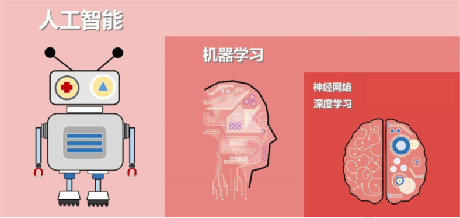

### 2. 从传统方法到神经网络
#### 考虑这个问题：如何让电脑识别图片有一只猫？
   我们人类非常的容易做到，但是让计算机做到却很难
   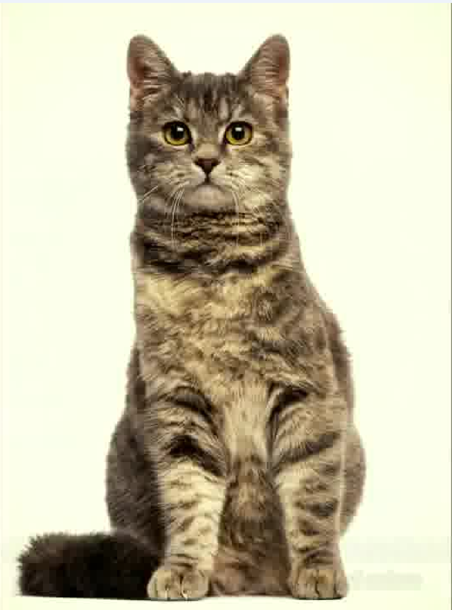
#### 传统方法：
   我把他们统称为数学建模
   边缘检测+轮廓提取：两个尖尖的耳朵，圆圆的脸，胖胖的身体。看起来完美得解决了。
   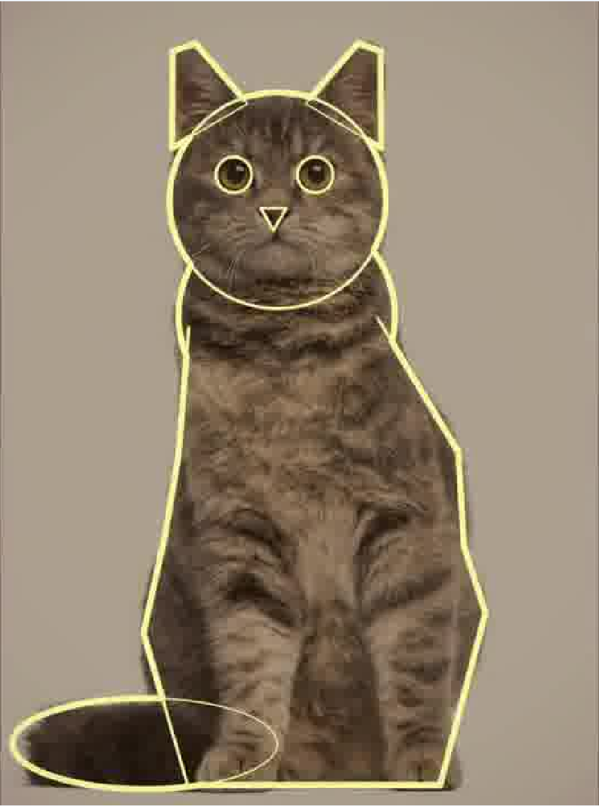
#### 可是这个怎么办？，再检了一个类似的模型
   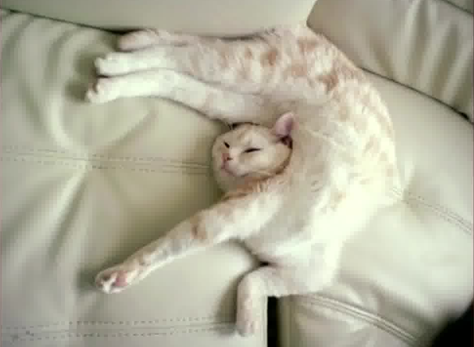
#### 这个呢？传统方法根本没办法解决
   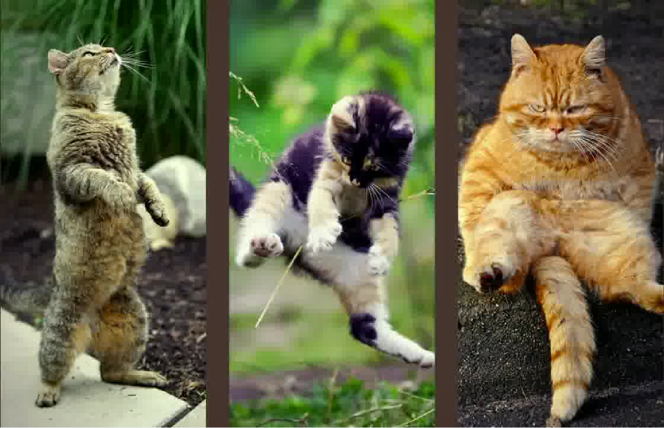
#### 思考：为什么计算机很难做到，而我们人类3岁的小朋友就能做到？
   如果我们把眼睛看作是相机，他们每200毫秒就拍一张照片，一个人到3岁的时候已经看见1亿张照片。
   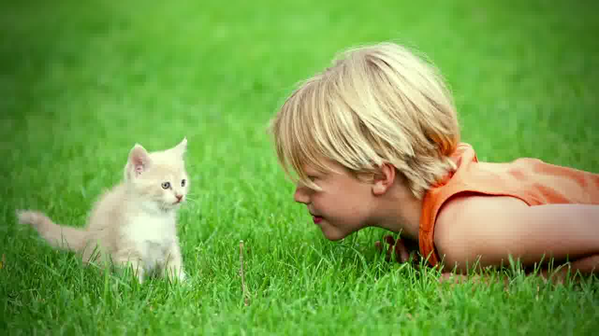
   大脑可视作为1000多亿神经元组成的神经网络，这是大自然经过了大约5亿4千年的努力后完成。
   
   1943年，神经病学家和神经元解剖学家W.S.McCulloch和数学家W.A.Pitts提出神经元的数学描述和结构。
   并且证明了只要有足够的简单神经元，可以模拟任何计算函数。
   单个神经元
   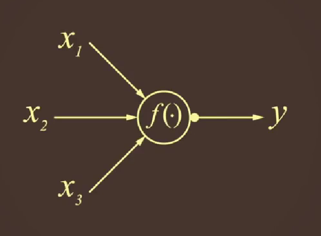
   神经网络诞生
   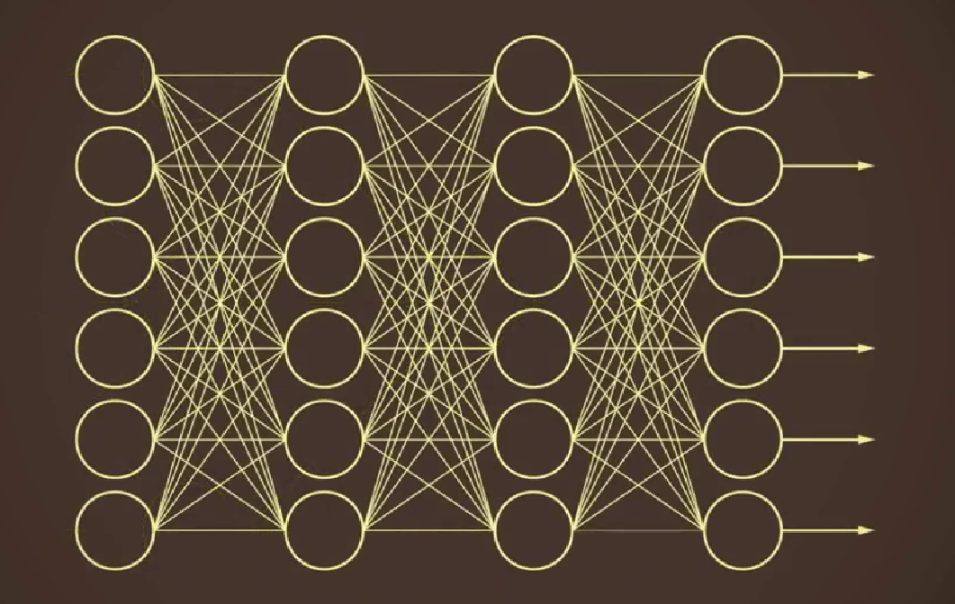
   于是乎，神经网络诞生了
### 3. 深度学习到底是如何工作得
####  深度学习就是自动找一个函数f
   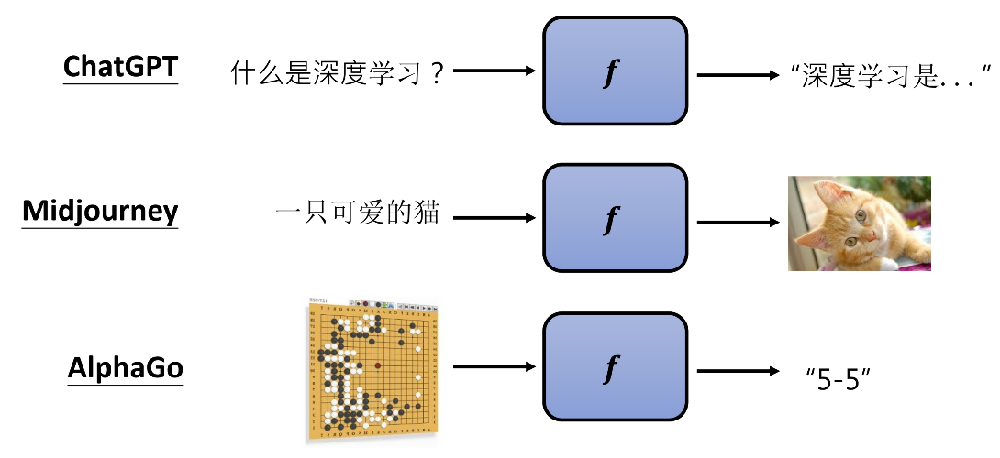
####  寻找函数得步骤
   第一步设定范围(定义模型Model)：订出函数的集合，为什么是集合，因为参数还不知道。CNN，Transformer
   f = sigmoid( sum(axi)+b) ，x是每个像素
   第二步设定目标(计算损失Loss)：监督学习，半监督学习，无监督学习，强化学习。
   配图
   第三步达成目标(训练模型参数)：最优化Optimization，梯度下降GradientDescent
   演示训练过程
### 4. 基本概念
   根据输出格式不同分为：回归，分类，结构化学习(生成式学习)。
   根据损失计算方式分为：监督学习，非监督学习，半监督学习，强化学习。
   数据集划分：训练集，验证集，测试集
   训练超参数：学习率，batch-size，epoch，迭代次数
   模型内部函数：FC, 激活函数
   模型规模：参数个数，计算量
   学习方法：梯度下降
   模型评估：召回率(查全率)，精度（查准率） 
## 三. 深度学习的基础模型
### 1. 最初的神经网络：全连接网络FC
   单层感知器
   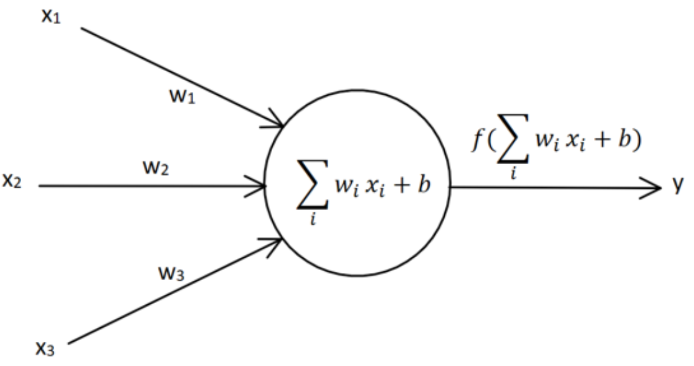
   多层感知器MPL, BP神经网络
   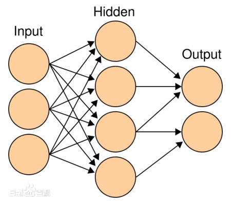
### 2. 解决各种场景问题的神经网络
   卷积神经网络CNN：局部范围,图像非序列问题
   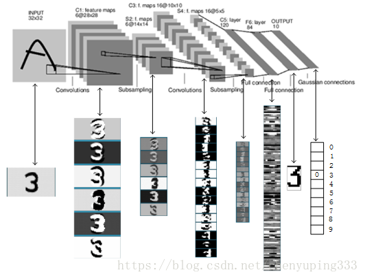
   循环神经网络RNN/LSTM：序列问题
   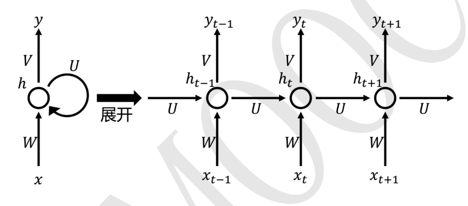
   强化学习(RL)
      基本原理: 不是提前暴力试错，也不是记忆牌局。
      游戏与对弈
   图神经网络(GNN)
      图(点和边)问题
      原理与应用领域
      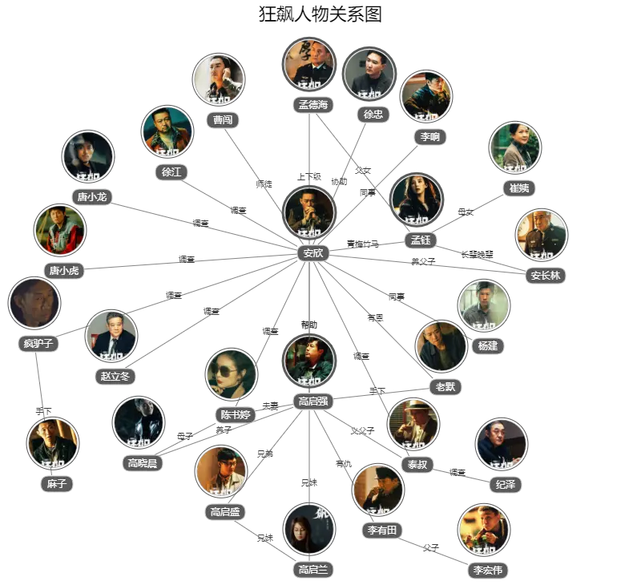
   生成式网络：
      GAN: 生成对抗网络
      Diffusion模型取代GAN
### 3. Transformer：网络结构大一统
   ResNet
     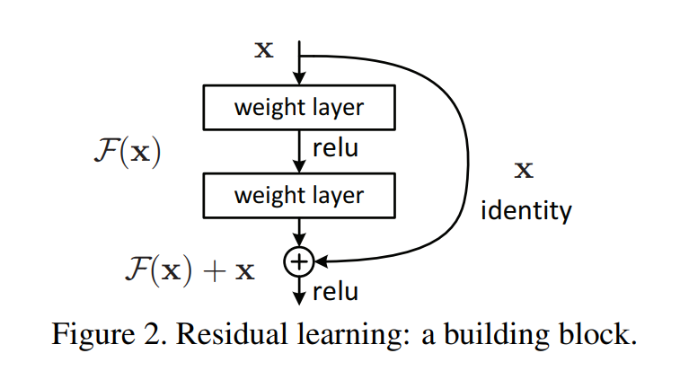
     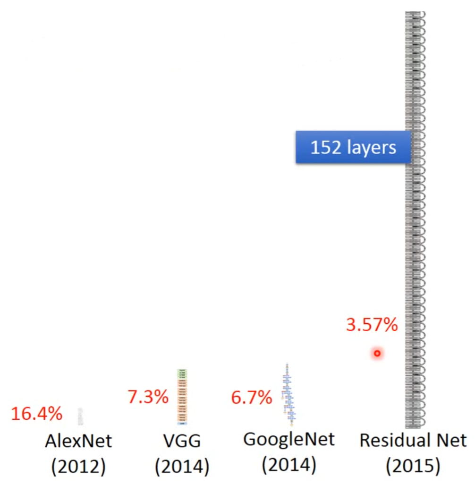
   注意力机制：统一CNN,RNN,RL
     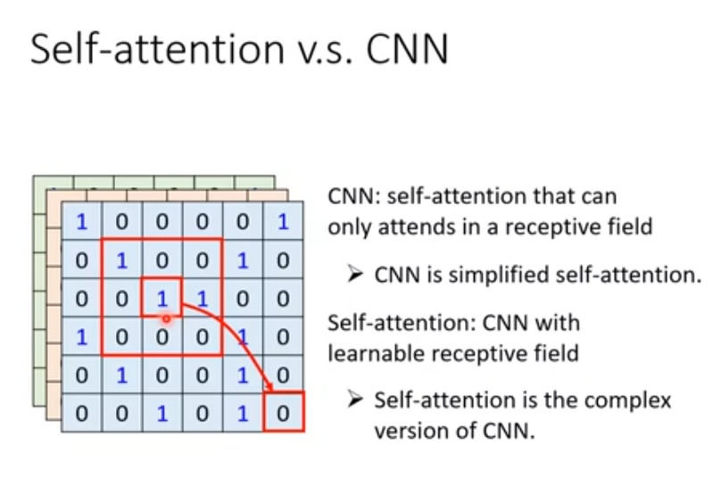
     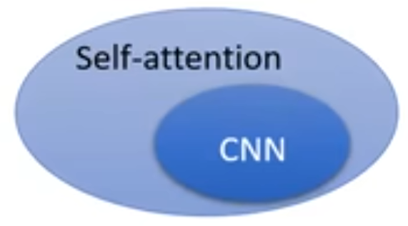
     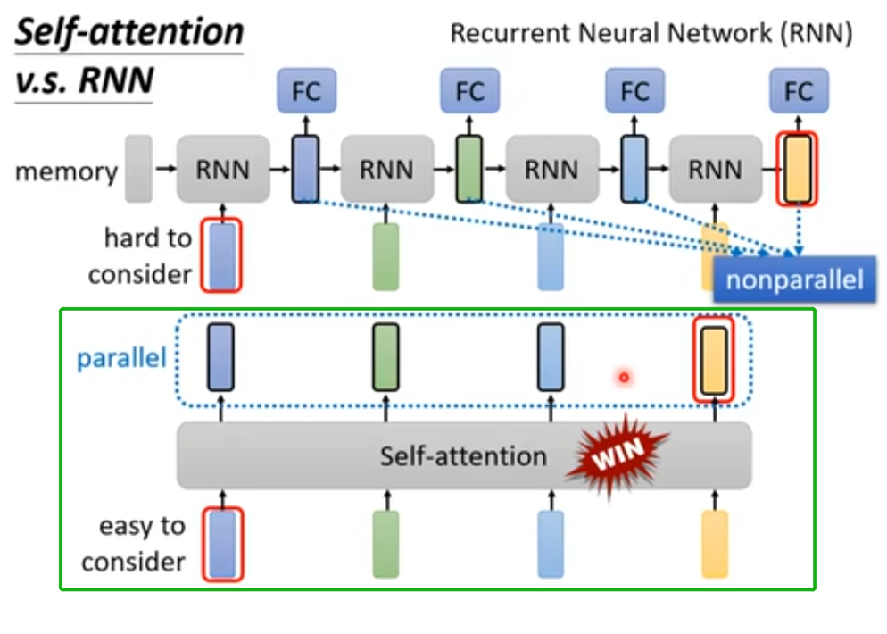
   Transformer：注意力机制 + ResNet + seq2seq
### 5. 大模型：任务大一统
   大样本训练：Pre-Train
   多任务学习：从 Finetuning 到 Prompting
   cv和NLP融合的多模态学习：CLIP
### 6. 姑姑神经网络发展的重点事件
   1958年：计算机学家 Frank Rosenblatt 提出了一种神经网络结构，称为感知器(Perceptron)，线性模型。
   1986年: 多层感知器MLP（Multi-layer Perceptron）与 反向传播训练算法BP
   ---学术圈引起轰动，各大公司分发开始如今，技术敏感非常重要。
   2012年: Hinton 课题组为了证明深度学习的潜力，首次参加 ImageNet 图像识别比赛， 通过 CNN 网络 AlexNet 一举夺得冠军
   2014年: 生成式对抗网络（Generative Adversarial Network, GAN）诞生
   2015年：深度残差网络诞生, 机器首次超越人类。
   ---让普通人看到AI巨大潜力
   2016年: 强化学习：人工智能围棋比赛, AlphaGo 战胜了世界围棋冠军、职业九段选手李世石，并以 4:1 的总比分获胜
   2017年：Transformer诞生
   2018年: GPT,BERT
   ---用AI提升生产力，新的工业革命
   2023年: ChatGPT
## 四. 深度学习的主要应用方向
### 1. 计算机视觉(CV)
   图像分类：LeNet AlexNet VGG GoogleNet ResNet
   目标检测：FastRCNN SSD Yolov1-8
   图像分割：语义分割，实例分割，全景分割: FCN UNet DeepLab
   关键点检测：
   检索跟踪：deepsort
   视频理解：抠图，分类
   ViT
   案例：
     PPOcr的文字提取（11）
     实战 广告检测项目
### 2. 自然语言处理(NLP)
   应用
     文本分类/情感分类
     分词标注
     机器翻译
     聊天机器人
     自动摘要
     自文章生成
     图片描述
   基本流程？
   分词器(Tokenizer,中，韩文，日文特有)：词典法，HMM隐马尔可夫模型，jieba库。
   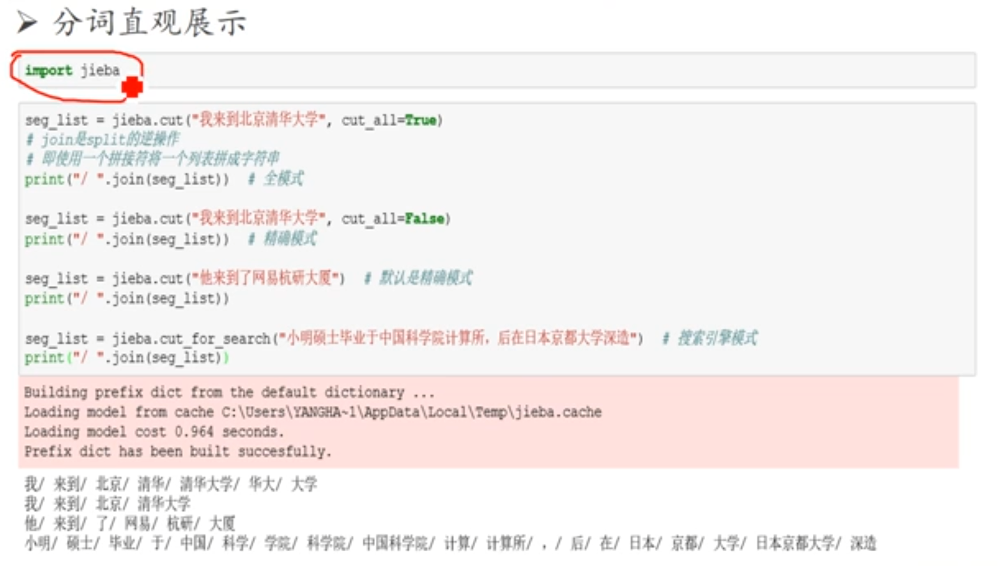
   NNLM模型
   Word2Vec:word embedding
   Self-Attention
   Transformer: encoder-decoder的序列模型
   BERT: Transformer的encoder部分。+ finetune完成各种任务
   GPT1：Transformer的decoder部分，预训练+fine-tuning，因为人类提供的监督数据实在有限。
   GPT2：去掉fine-tune，训练出一个通用的模型. Prompt
   GPT3：
     Zero-shot：只给出任务描述（description）和任务提示（prompt） 
     One-shot：  给出任务描述，给出一个例子（example），给出任务提示
     Few-shot：  给出任务描述，给出若干个例子，给出任务提示
   ChatGPT(GPT3.5,GPT4)：监督学习+ 基于人类反馈的强化学习。
### 3. 人工智能生成内容(AIGC)
   文本生成：
     ChatGPT
   图像生成，视频生成
     生成对抗网络： GAN, DCGAN StyleGAN BigGAN StackGAN Pix2Pix Age-cGAN CycleGAN
     扩散模型Diffusion: Stable Diffusion。 DALL-E 2。 MidJourney
   声音生成
     InstructTTS：http://dongchaoyang.top/InstructTTS/ 
     https://audioldm.github.io/
   新视角合成与三维重建：
     Nerf
   实例：
     nerf的例子
     基于ChatGPT和Midjourney的文字冒险游戏
     ECVSR超分 [https://mp.weixin.qq.com/s/PfFtCFKKVxqirhHRKjN7oA]
     太空歌剧院（13）
     
     https://baijiahao.baidu.com/s?id=1757770013219646468&wfr=spider&for=pc
### 4. 音频信号处理(ASP)
   音频分类
   音频事件检测
   语音识别
   音乐检索
   音乐生成
   语音生成(TTS)
   语音克隆
### 5. 其他应用方向：
   多模态：图文检索，视觉问答，视觉翻译，视觉推理，文生图，图生文...
   三维重建: ORB-SLAM，激光SLAM，Nerf
## 五. 深度学习从学习到部署
### 1. 学习路线图
   基础知识(python，数学，英语) 
   课程课程（学习原理，学习框架，简单的模型） 
   学习成熟模型(yolo，GPT)
   设计模型+训练部署（标注数据集，训练模型，部署框架）
### 2. 基础知识：
   python(必须)
     为什么：简单高效门槛低，行业从业者都在中都用。
     学什么：python基础 + numpy + pytorch
     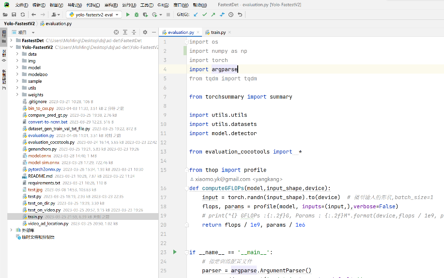
   数学：
     多元函数的求导，方向导数，梯度
     线性代数，矩阵运算
     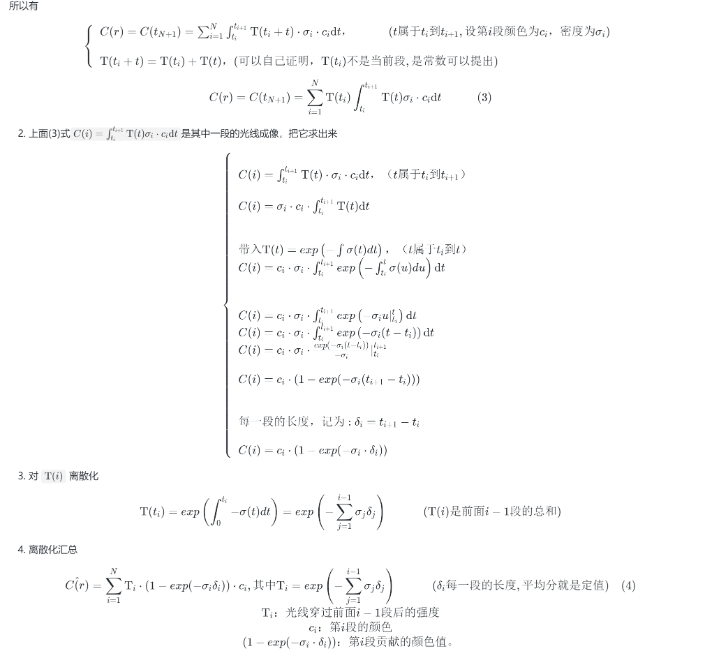
   英语：知识都是最新，交流全靠读论文
     不学也可以：等人翻译滞后，垂直细分领域没有人翻译，google翻译 
     深度残差网络:https://arxiv.org/pdf/1512.03385.pdf
     
     https://proceedings.neurips.cc/paper/2017/file/3f5ee243547dee91fbd053c1c4a845aa-Paper.pdf
     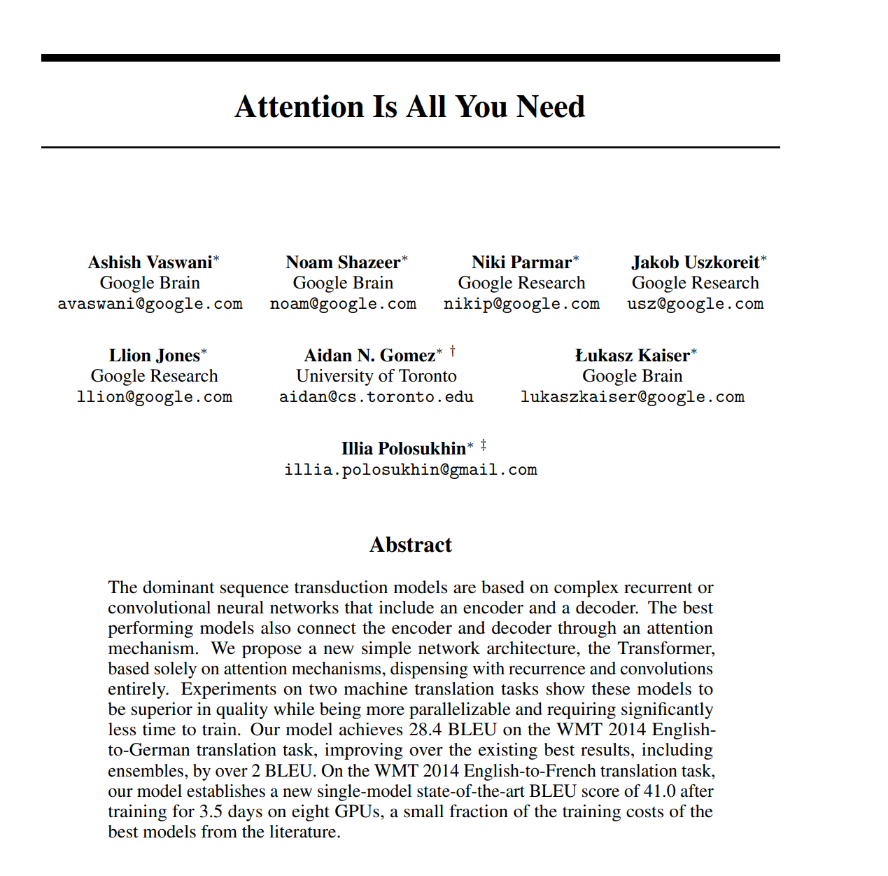
   传统机器学习，图像处理还需要学吗？

### 3. 课程学习
   李宏毅 
     视频课程：https://speech.ee.ntu.edu.tw/~hylee
     特点：台湾大学专业讲课老师，讲课诙谐幽默，逻辑清晰，随时都在更新AI知识，但不讲代码
   李沐
     书籍《动⼿学深度学习》
     视频课程：https://zh-v2.d2l.ai/ 
     特点：讲代码，逐行读论文，解读最新的AI知识
   吴恩达
     视频课程：https://www.coursera.org/ 
     特点：讲英文，七天内免费
   其他：b站，youtube等很多很多，比如北航的鲁鹏，还有很多老师、学生、个人开发者都在发布。
### 4. 训练框架
  Pytorch（必须先学，可能就够用）
  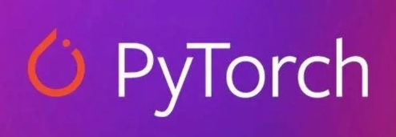
  TensorFlow（有精力再学）
  
  Panddle
  Caffe
  MxNet
  CNTK
  ...
### 5. 标注工具
  文件夹分类：图像分类
  labelimg：目标检测
  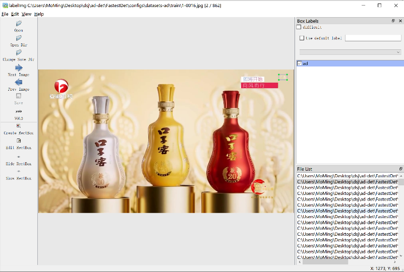
  labelme：图像分割，关键点检测
  
### 6. 数据集
  手写数字mnist数据集：65k张图片
  cifar-10：10类动图：60k张
  ImageNet：超过1400万张，约22000个类别。
  COCO:训练、验证和测试,每部分分别包含 118287, 5000 和 40670张图片,总大小约25g
  ...
### 6. 推理框架：跟训练框架分开
  英伟达tensorrt
  英特尔openvino
  微软onnx-runtime
  google的tf
  Apple的CoreML
  meata的libtorch
  opencv的dnn
  腾讯ncnn
  案例mnn
  百度的paddle
  字节跳动的LightSeq
  ...
### 7. 硬件部署：
   cpu
   英伟达显卡
   英伟达jetson嵌入式
   英特尔vpu
   MacM1，M2
   华为海思nnie
   移动端(android,ios)
   web前端(webassembly)
### 8. 部署案例, 嵌入式上部署
   海思Hi3516DV300的人脸识别
   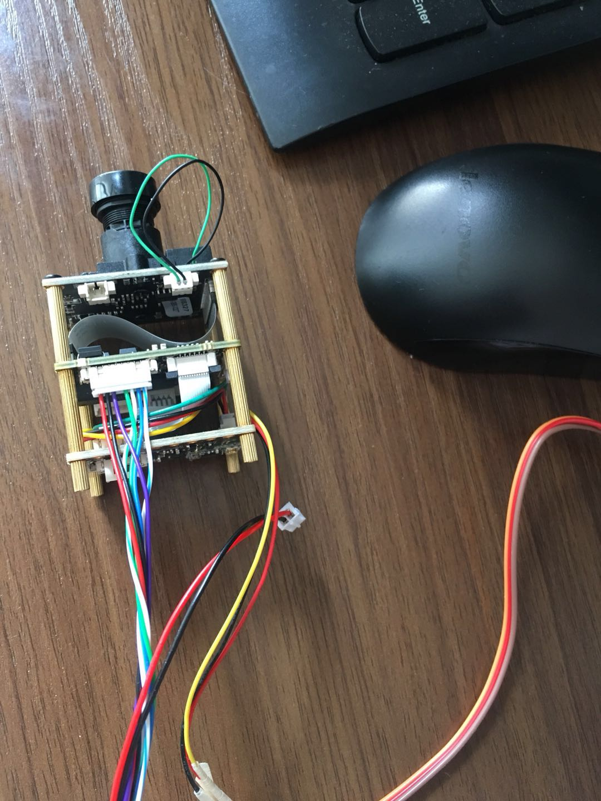
   手机展示
   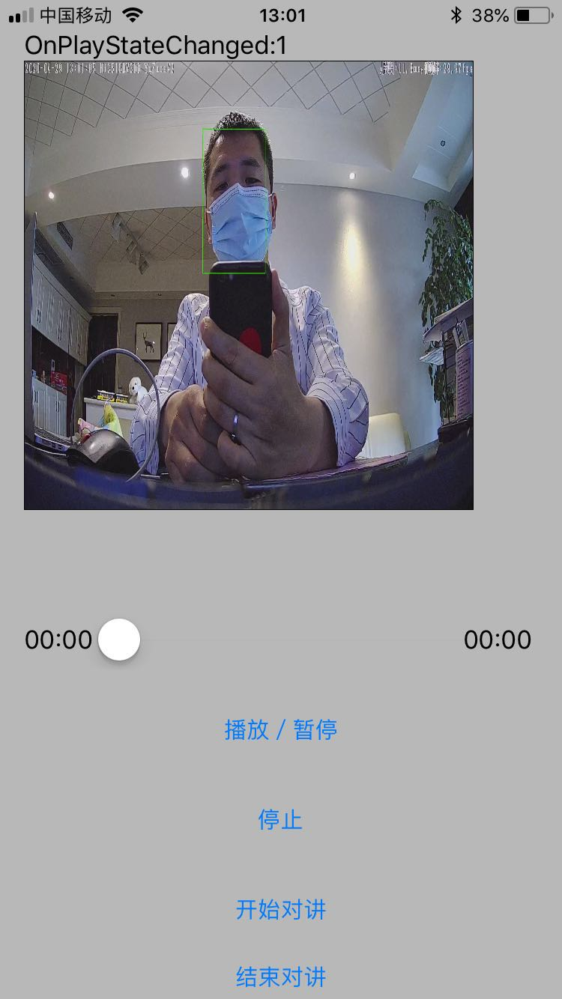
   英伟达Jetson Xavier NX部署人体和关键点检测
   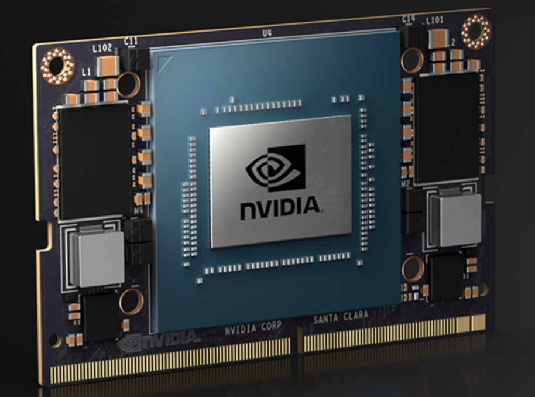
   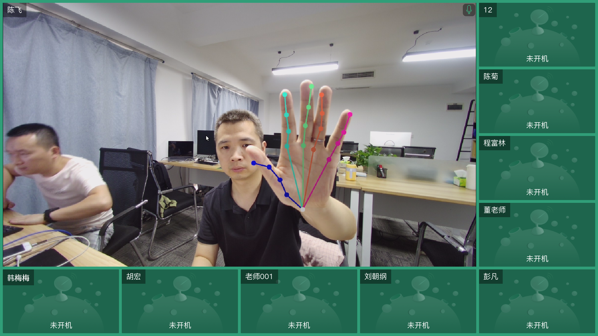
   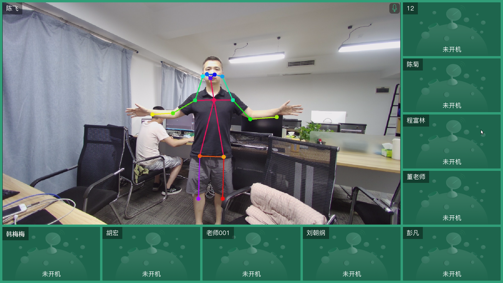
### 6. 主要的研究机构和会议
   OpenAI，GoogleBrain，DeepMind, OpenMMLab
   ILSVRC：
   CVPR, ICCV,ECCV,ACCV,ICLR,neurips
   英伟达
### 5. 深度学习领域重要人物
   Geoffrey Hinton: 公认的“深度学习之父”
   Yann LeCun: 卷积网络之父, Hinton的学生，1998年LeNet。
   Yoshua Bengio：Bengio的一篇“A neural probabilistic language model”论文开创了神经网络语言模型的先河
   Andrew Ng（吴恩达）：创立Google Brain和Coursera ，提供了大量的在线人工智能课程，提供了大量的在线人工智能课程。Coursera上市市值超40亿美元，恩达成亿万富豪。
   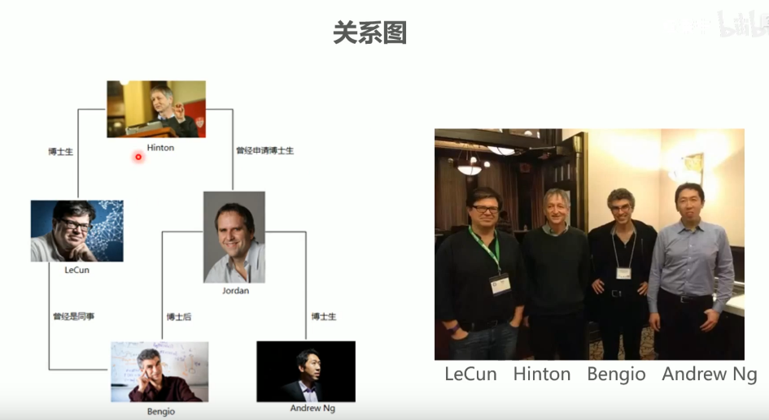
   何恺明（Kaiming He）：ResNets,Mask R-CNN。
   李飞飞：ImageNet
   贾扬清（领导Caffe2和ONNX，加入阿里后口碑差，已经离职）
   Joseph Redmon（yolo之父）
### 9. 参考文献：
   书籍《深度学习从0到1》覃秉丰
   书籍《动⼿学深度学习》李沐
   报告《腾讯研究院：AIGC发展趋势报告2023》腾讯
   演讲《我们怎么教计算机理解图片》李飞飞
   视频课程： 李宏毅，李沐，贾志刚，唐宇迪，覃秉丰，等等
## 六. 问答

