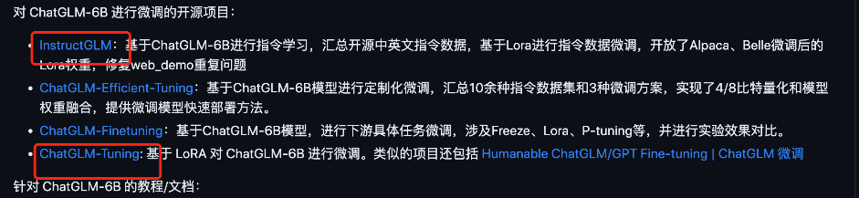

# 模型微调技术

## 一. 方法
1. 不改变模型参数
    - prompt：提示词工程
    - In-context learning

2. 改变模型全部参数
    - Pretrain：预训练
    - Continue Pretrain: 增量预训练
    - SFT：有监督微调
    - DPO（Direct Preference Optimization）: 直接偏好优化, 更进一步的有监督微调。
    - PPO：一种强化方法
    - RLHF: 基于人类反馈的强化学习，用PPO
    - RLAIF: 基于AI反馈的强化学习，用PPO
    - IFT:(Instruction Fine-Tuning): 指令微调
    - UFT:(Unsupervised Fine-Tuning):无监督微调
3. 改变模型部分参数
   1. p-tuning
   2. lora-tuning
   3. fine-tuning

## 二. Lora

大模型参数高效微调技术原理综述（一）-背景、参数高效微调简介
大模型参数高效微调技术原理综述（二）-BitFit、Prefix Tuning、Prompt Tuning
大模型参数高效微调技术原理综述（三）-P-Tuning、P-Tuning v2
大模型参数高效微调技术原理综述（四）-Adapter Tuning及其变体
大模型参数高效微调技术原理综述（五）-LoRA、AdaLoRA、QLoRA
大模型参数高效微调技术原理综述（六）-MAM Adapter、UniPELT
大模型参数高效微调技术原理综述（七）-最佳实践、总结